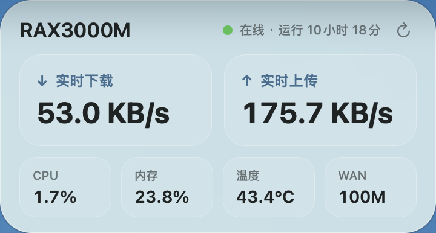

# Router Status Widget for macOS

一个轻量的 macOS 桌面路由器状态小组件。桌面在前台时，它通过局域网 Token API 建立 SSE 连接，由 OpenWrt 每 5 秒推送状态；切到其他应用或全屏空间后立即断开，路由器不再采样。组件以浅色毛玻璃卡片展示 WAN 实时速率、物理协商速率、CPU、内存、温度和运行时间，并提供受限的路由器重启按钮。

小组件位于桌面层，普通应用窗口会自然盖住它，不会一直悬浮在最前面。点击桌面或使用“显示桌面”即可查看；菜单栏网络图标可以隐藏、显示、立即刷新或退出。



在 RAX3000M/OpenWrt 25.12.5 与 macOS 26 上实测，应用物理内存约 17 MB，空闲 CPU 接近 0%。实际占用会随系统版本变化。

## 展示内容

- WAN 实时下载和上传速率
- WAN 物理链路协商速率，例如 `100 Mbps` 或 `1 Gbps`
- 路由器 CPU、内存使用率和芯片温度
- 路由器运行时间和 API 连接状态
- 通过右上角图标请求路由器重启
- 仅在桌面/Finder 位于前台时接收 SSE，进入后台自动停止

## 架构选择

OpenWrt 已经提供 `rpcd + uhttpd-mod-ubus` JSON-RPC API，但官方接口需要先登录取得有时效的 `ubus_rpc_session`，并通过 rpcd ACL 授权。这个项目只需要少量状态数据和单一的重启动作，因此没有让桌面应用持有 OpenWrt root 密码或广泛的 ubus 权限。

项目安装一个独立的最小 uhttpd 实例：

- 仅绑定指定的 LAN IPv4 地址，默认 `192.168.31.1:8099`；
- 使用随机的 256 位固定 Bearer Token；
- 状态接口只接受 `GET /cgi-bin/status`；
- 事件接口只接受 `GET /cgi-bin/events`，并以 SSE 推送只读快照；
- 重启接口只接受 `POST /cgi-bin/reboot` 和精确的 `{"action":"reboot"}` 请求体；
- 只读取 `/proc`、`/sys/class/net` 和 `/sys/class/thermal`；
- 除固定调用 `/sbin/reboot` 外，不提供 UCI、任意命令执行、文件写入、关机或其他系统控制能力；
- 不监听公网 IPv6，也不要求新增 WAN 防火墙规则。

## 要求

- macOS 13 或更高版本
- Apple Command Line Tools 或 Xcode
- OpenWrt 路由器已经安装 `uhttpd`
- 安装API时可以通过SSH管理路由器；小组件日常运行不使用SSH
- WAN接口提供Linux sysfs字节计数和链路速率文件

## 安装

以下示例使用本项目默认值：

| 配置 | 默认值 |
| --- | --- |
| 路由器LAN地址 | `192.168.31.1` |
| API端口 | `8099` |
| WAN接口 | `eth1` |
| SSE推送周期 | 5秒 |

### 1. 生成Token

在Mac执行：

```bash
openssl rand -hex -out /private/tmp/router-status-api.token 32
chmod 600 /private/tmp/router-status-api.token
```

Token只保存在Mac和路由器，不得提交Git。

### 2. 安装OpenWrt API

```bash
scp -O \
  router/openwrt/router-status-api.cgi \
  router/openwrt/router-events-api.cgi \
  router/openwrt/router-reboot-api.cgi \
  router/openwrt/install-router-status-api.sh \
  /private/tmp/router-status-api.token \
  root@192.168.31.1:/tmp/

ssh root@192.168.31.1 '
ROUTER_STATUS_LAN_IP=192.168.31.1 \
ROUTER_STATUS_API_PORT=8099 \
ROUTER_STATUS_WAN_INTERFACE=eth1 \
sh /tmp/install-router-status-api.sh
'
```

安装脚本会：

1. 备份 `/etc/config/uhttpd`；
2. 安装状态、SSE、重启 CGI 和600权限Token；
3. 创建独立 `uhttpd.router_status` 实例；
4. 仅监听 `192.168.31.1:8099`；
5. 重启uhttpd使配置生效。

### 3. 安装Mac Token

```bash
mkdir -p "$HOME/Library/Application Support/RouterStatusWidget"
install -m 600 \
  /private/tmp/router-status-api.token \
  "$HOME/Library/Application Support/RouterStatusWidget/api-token"
```

### 4. 构建并运行

```bash
zsh build.sh
open build/RouterStatusWidget.app
```

生成的应用位于 `build/RouterStatusWidget.app`，构建脚本会执行本地 ad-hoc 签名。首次打开下载的CI构建产物时，macOS可能要求在“隐私与安全性”中确认。

## 验证API

无Token请求应返回 `401 Unauthorized`：

```bash
curl -i http://192.168.31.1:8099/cgi-bin/status
```

带正确Token应返回 `200 OK`：

```bash
curl -i \
  -H "Authorization: Bearer $(tr -d '\n' < "$HOME/Library/Application Support/RouterStatusWidget/api-token")" \
  http://192.168.31.1:8099/cgi-bin/status
```

响应格式：

```json
{
  "version": 1,
  "cpu_total": 6837377,
  "cpu_idle": 6701119,
  "mem_total_kb": 496700,
  "mem_available_kb": 378928,
  "rx_bytes": 7545671984,
  "tx_bytes": 1024043164,
  "link_mbps": 100,
  "uptime_seconds": 34299,
  "temperature_c": 42.8
}
```

SSE 是只读接口，可以用下面的命令短暂验证。`--max-time 7` 会在收到约两帧后主动断开，路由器端 CGI 随连接一起退出：

```bash
curl -sN --max-time 7 \
  -H "Authorization: Bearer $(tr -d '\n' < "$HOME/Library/Application Support/RouterStatusWidget/api-token")" \
  -H 'Accept: text/event-stream' \
  http://192.168.31.1:8099/cgi-bin/events
```

重启接口需要有效 Token、`POST` 方法和精确请求体。应用收到 `202 Accepted` 后，路由器才会在短暂延时后调用 `/sbin/reboot`。不要为了验证接口而手动执行下面的有效请求；它会真实重启路由器：

```text
POST /cgi-bin/reboot
Authorization: Bearer <token>
Content-Type: application/json

{"action":"reboot"}
```

## Mac配置

修改API地址：

```bash
defaults write com.ming.RouterStatusWidget APIURL \
  'http://192.168.31.1:8099/cgi-bin/status'
```

恢复默认地址：

```bash
defaults delete com.ming.RouterStatusWidget APIURL
```

修改后退出并重新启动应用。

## 数据与安全边界

- Mac应用使用 `URLSession`，不启动SSH进程，也不保存路由器密码或私钥。
- SSE 仅在 Finder/桌面位于前台时保持；切换应用、进入全屏空间或休眠后会取消连接。
- Token文件必须保持600权限，仓库的 `.gitignore` 不替代凭证管理。
- 状态API只读取 `/proc`、`/sys/class/net` 和 `/sys/class/thermal`，不会修改系统配置。
- 重启API只能调用 `/sbin/reboot`；代码中不包含 `poweroff`、`halt` 或任意命令参数。
- 应用不连接互联网、不上传遥测数据。
- 当前API使用局域网HTTP，Token会在LAN内传输；这适用于可信家庭网络，但不适合访客网络、公共网络或跨互联网使用。
- 任何取得Token的客户端都可以请求重启，因此不要共享Token，也不要将API端口暴露到WAN。
- 若局域网中存在不可信客户端，应改用HTTPS并在Mac端固定证书，或继续使用官方rpcd ACL与短期会话。
- 不要把API实例绑定到 `0.0.0.0`、`[::]` 或WAN地址。

## 实现方式

项目使用纯AppKit和Foundation编写，没有SwiftUI、WebView、Electron、Node.js或第三方运行时。

```text
macOS 前台/Space 状态
        │
        ├── 桌面在前台：建立 SSE
        └── 进入后台：取消 SSE
                    │
                    ▼
URLSession + Authorization: Bearer（单一长连接）
        │
        ▼
仅绑定LAN的OpenWrt uhttpd CGI
        │
        ▼
/proc 与 /sys/class 的按需只读采样（每5秒）
        │
        ▼
计算相邻快照差值
        │
        ▼
AppKit浅色毛玻璃桌面卡片与菜单栏
```

核心实现分为六部分：

1. `RouterStatusApplication` 显式创建 `NSApplication` 并保持应用代理生命周期；
2. `StatusCardController` 创建轻量的浅色毛玻璃卡片并放在桌面图标层；
3. `RouterMonitor` 监听前台应用和 Space 变化，按需创建或取消 SSE；
4. `Counters` 保存上一轮累计值，用相邻快照计算 CPU 百分比和每秒速率。
5. 独立重启 CGI 只接受固定动作，并在返回 `202 Accepted` 后调用 `/sbin/reboot`。
6. SSE CGI 只在客户端连接期间每 5 秒采样一次，断开后立即退出。

### 指标来源

| 指标 | OpenWrt数据源 | 计算方式 |
| --- | --- | --- |
| CPU | `/proc/stat` | 两次总计数和空闲计数的差值 |
| 内存 | `/proc/meminfo` | `(MemTotal - MemAvailable) / MemTotal` |
| 下载 | `/sys/class/net/<WAN>/statistics/rx_bytes` | 两次累计字节差值除以时间 |
| 上传 | `/sys/class/net/<WAN>/statistics/tx_bytes` | 两次累计字节差值除以时间 |
| WAN速率 | `/sys/class/net/<WAN>/speed` | 网卡PHY当前协商速率 |
| 运行时间 | `/proc/uptime` | 秒数转换为天、小时和分钟 |
| 温度 | `/sys/class/thermal/thermal_zone*/temp` | 优先读取 CPU thermal zone 并换算为摄氏度 |

## 开发指南

### 开发原则

- 保持单一原生Mac可执行文件，不引入非必要依赖；
- 状态API保持只读；系统操作必须使用独立端点、固定动作和严格请求校验；
- 前台只保持一个 SSE 连接，后台不得保留定时器、HTTP轮询或路由器采样进程；
- Token不得写入源码、Info.plist、UserDefaults、日志、URL或Git；
- API地址和WAN接口等输入在使用前必须校验；
- UI更新必须回到主线程；
- 构建缓存和`.app`产物不得提交Git；
- 修改后至少执行本地构建、CGI语法、Info.plist、签名和架构检查。

### 新增一个指标

1. 在 `router-status-api.cgi` 中读取新的只读数据并加入版本化JSON；
2. 在 `APISnapshot` 中添加对应字段；
3. 在 `RouterMonitor.consume(_:)` 中计算或转换指标；
4. 在 `StatusCardController` 中增加控件并更新显示；
5. 更新“指标来源”和API响应示例；
6. 验证无Token、错误Token、路由器离线和字段缺失场景。

### 本地验证

```bash
sh -n router/openwrt/router-status-api.cgi
sh -n router/openwrt/router-events-api.cgi
sh -n router/openwrt/router-reboot-api.cgi
sh -n router/openwrt/install-router-status-api.sh
sh -n router/openwrt/uninstall-router-status-api.sh
zsh build.sh
plutil -lint build/RouterStatusWidget.app/Contents/Info.plist
codesign --verify --deep --strict build/RouterStatusWidget.app
file build/RouterStatusWidget.app/Contents/MacOS/RouterStatusWidget
```

Apple Silicon构建应包含：

```text
Mach-O 64-bit executable arm64
```

## 卸载

```bash
scp -O router/openwrt/uninstall-router-status-api.sh root@192.168.31.1:/tmp/
ssh root@192.168.31.1 'sh /tmp/uninstall-router-status-api.sh'
rm "$HOME/Library/Application Support/RouterStatusWidget/api-token"
```

卸载脚本只删除本项目的uhttpd实例、API文件和Token，不影响LuCI主实例。

## CI/CD

仓库中的 `macos-router-status-widget.yml` 使用GitHub Actions ARM64 `macos-15` runner：

1. 检查五个OpenWrt shell/CGI脚本语法；
2. 编译Mac应用；
3. 校验app bundle、Info.plist、代码签名和架构；
4. 压缩并上传 `RouterStatusWidget-macos-arm64.zip`；
5. 推送 `router-status-v*` 标签时自动创建GitHub Release。

```bash
git tag router-status-v1.0.0
git push origin router-status-v1.0.0
```

CI构建采用ad-hoc签名，不等同于Apple Developer ID签名和公证。

## 目录结构

```text
junkyard/
├── .github/
│   └── workflows/
│       └── macos-router-status-widget.yml
├── .gitignore
├── LICENSE
├── README.md
└── macos-router-status-widget/
    ├── assets/
    │   └── router-status-widget.png
    ├── router/
    │   └── openwrt/
    │       ├── install-router-status-api.sh
    │       ├── router-events-api.cgi
    │       ├── router-reboot-api.cgi
    │       ├── router-status-api.cgi
    │       └── uninstall-router-status-api.sh
    ├── Sources/
    │   └── RouterStatusWidget.swift
    ├── Info.plist
    ├── README.md
    └── build.sh
```

本地构建会额外生成被Git忽略的 `.build/module-cache/` 和 `build/RouterStatusWidget.app/`。项目刻意不包含 `.xcodeproj`，本地与CI统一通过 `build.sh` 调用当前Xcode/Command Line Tools中的 `swiftc`。
